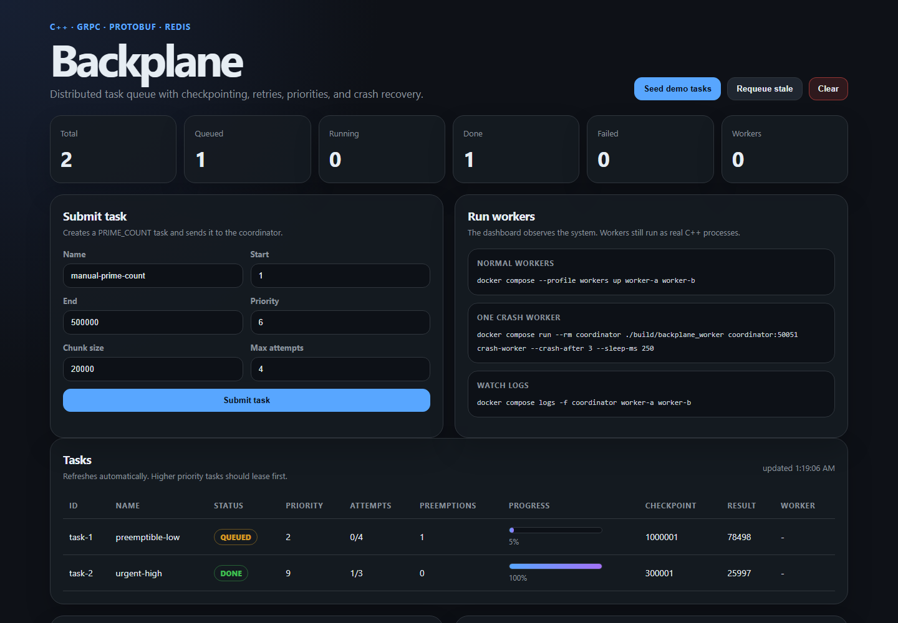
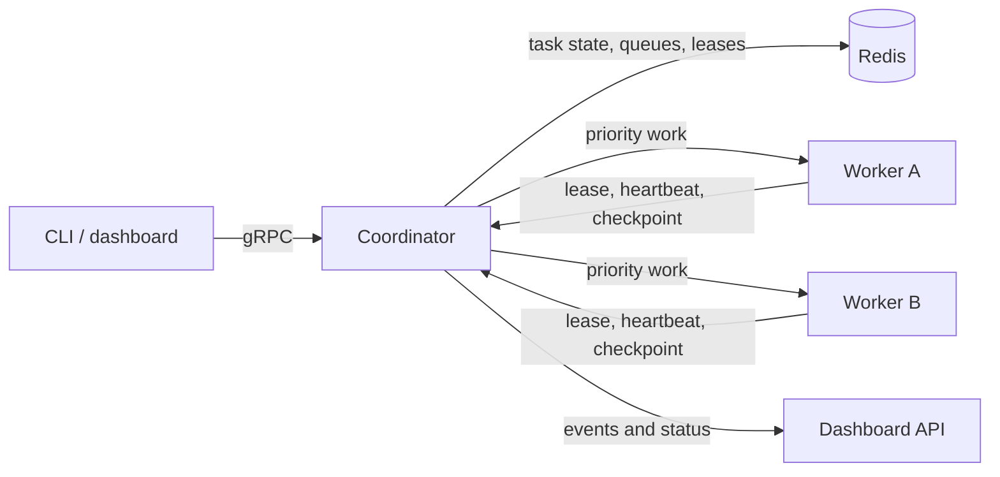

# Backplane

[](https://github.com/anishsbala/backplane/actions/workflows/ci.yml)
[](LICENSE)

Backplane is a fault-tolerant C++ task-processing system. A gRPC coordinator schedules Redis-backed work across worker processes, preserves durable checkpoints, retries failures, recovers expired leases, and cooperatively preempts low-priority tasks.

The demo task is `PRIME_COUNT`: count how many prime numbers exist in a numeric range. It is CPU-bound and easy to split into chunks, which makes checkpointing and recovery visible.



## Stack

- C++17
- gRPC
- Protobuf
- Redis
- hiredis
- Docker / Docker Compose
- CMake
- Small Node/HTML dashboard for observing the C++ system

## Features

- Submit tasks through gRPC or the dashboard
- Store task state, worker state, queue state, and event logs in Redis
- Lease queued tasks to worker processes
- Use Redis sorted sets for priority scheduling
- Cooperatively preempt lower-priority work at durable checkpoint boundaries
- Checkpoint after each chunk of work
- Retry normal task failures until `max_attempts`
- Requeue unfinished work when a worker crashes or stops heartbeating
- Verify 95% checkpoint recovery with an executable crash benchmark
- Track workers and coordinator events
- Observe everything from a web dashboard at `localhost:8080`

## Architecture



The coordinator is the scheduling authority; Redis stores durable task state, priority queues, leases, worker heartbeats, checkpoints, and the event stream used by the dashboard.

## Project layout

```text
backplane/
  proto/backplane.proto        Protobuf API
  include/                     Shared C++ headers
  src/server.cpp               Coordinator gRPC service
  src/worker.cpp               Worker process
  src/client.cpp               CLI client
  src/redis_store.cpp          Redis-backed storage layer
  dashboard/                   Web dashboard and API proxy
  docs/                        Architecture and demo notes
  docker-compose.yml           Redis, coordinator, dashboard, workers
  Dockerfile                   C++ build image
  Makefile                     Shortcut commands
  scripts/                     Demo helpers
```

## Run the full project

Start Redis, the coordinator, and the dashboard:

```bash
docker compose up --build -d redis coordinator dashboard
```

Open the dashboard:

```text
http://localhost:8080
```

Seed a few tasks from the dashboard, or run:

```bash
docker compose run --rm coordinator ./build/backplane_client coordinator:50051 seed
```

Start two real C++ workers:

```bash
docker compose --profile workers up worker-a worker-b
```

The dashboard will show queued tasks, running tasks, checkpoints, results, worker IDs, and coordinator events.

## CLI commands

Submit one task:

```bash
docker compose run --rm coordinator ./build/backplane_client coordinator:50051 submit primes-1 1 1000000 8 25000 4
```

List tasks:

```bash
docker compose run --rm coordinator ./build/backplane_client coordinator:50051 list
```

Show workers:

```bash
docker compose run --rm coordinator ./build/backplane_client coordinator:50051 workers
```

Show stats:

```bash
docker compose run --rm coordinator ./build/backplane_client coordinator:50051 stats
```

Show recent events:

```bash
docker compose run --rm coordinator ./build/backplane_client coordinator:50051 events 25
```

Clear Redis demo state:

```bash
docker compose run --rm coordinator ./build/backplane_client coordinator:50051 clear
```

## Crash recovery demo

Start clean:

```bash
docker compose down -v
docker compose up --build -d redis coordinator dashboard
```

Submit a longer task:

```bash
docker compose run --rm coordinator ./build/backplane_client coordinator:50051 submit recover-demo 1 1000000 8 25000 4
```

Run a worker that exits after three checkpoints:

```bash
docker compose run --rm coordinator ./build/backplane_worker coordinator:50051 crash-worker --crash-after 3 --sleep-ms 200
```

After the lease expires, the coordinator watchdog requeues the task while keeping the latest checkpoint. Then finish it:

```bash
docker compose run --rm coordinator ./build/backplane_worker coordinator:50051 worker-good --sleep-ms 100
```

Shortcut:

```bash
./scripts/run_crash_demo.sh
```

## Retry demo

This simulates a normal task error rather than a process crash:

```bash
./scripts/run_retry_demo.sh
```

The first worker reports a failure after two checkpoints. The coordinator puts the task back in the queue if attempts remain.

## Priority preemption demo

```bash
./scripts/run_preemption_demo.sh
```

The script starts a low-priority task, queues urgent work while it is running, and verifies that the worker yields at its next checkpoint. The high-priority task completes first, while the interrupted task keeps its checkpoint and partial result.

## Measured 95% crash recovery

```bash
./scripts/run_recovery_benchmark.sh
```

The benchmark uses 40 chunks and crashes a worker after checkpoint 38. It reads the task back from Redis, requires at least 95% saved progress, waits for the coordinator to requeue the expired lease, and confirms that a replacement worker completes the task.

This is an executable integration check rather than a theoretical estimate. Smaller chunks increase recovery precision at the cost of more checkpoint writes.

## Tests

```bash
cmake -S . -B build
cmake --build build
ctest --test-dir build --output-on-failure
```

## Redis data model

```text
backplane:tasks              set of all task ids
backplane:pending            sorted set of queued task ids, scored by priority
backplane:running            sorted set of running task ids, scored by lease deadline
backplane:task:<id>          hash containing task state/checkpoint/result
backplane:workers            set of worker ids seen by the coordinator
backplane:worker:<id>        hash containing current task and last seen time
backplane:events             capped list of recent coordinator events
backplane:next_task_id       integer task id counter
backplane:next_event_id      integer event id counter
backplane:queue_seq          integer used to keep FIFO ordering inside same priority
```

## Current limitations

- The coordinator is a single scheduling authority rather than a replicated control plane.
- Workers execute the built-in CPU-bound prime-count task; a plugin task interface is future work.
- Redis is configured as a single local instance for deterministic demos.
- Authentication, encrypted service-to-service transport, and multi-tenant isolation are outside the current lab scope.
