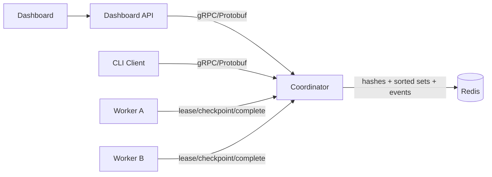
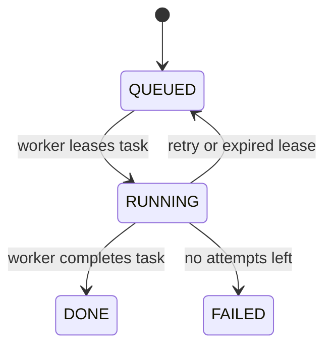

# Architecture

Backplane has four pieces:

1. **Coordinator**: C++ gRPC server that owns task state transitions.
2. **Workers**: C++ processes that lease tasks, do chunked work, and checkpoint progress.
3. **Redis**: Stores queue state, task hashes, running leases, workers, and events.
4. **Dashboard**: Small web UI that reads the coordinator through gRPC and shows system state.



## Task lifecycle



## Priority scheduling

Queued tasks are stored in `backplane:pending`, a Redis sorted set. The score is based on priority first and insert order second:

```text
score = priority * 1,000,000,000 - queue_sequence
```

The coordinator uses `ZREVRANGE` to lease the highest score first. That means higher-priority tasks run first, and tasks with the same priority run in FIFO order.

## Cooperative preemption

After every durable checkpoint, a worker asks the coordinator whether higher-priority work is waiting. If the highest queued priority exceeds the running task's priority, the coordinator returns the running task to the queue without changing its checkpoint or partial result. The same worker can then lease the urgent task.

Preemption occurs only at checkpoint boundaries. This avoids discarding completed chunks and makes the yield operation observable as a `PREEMPT` event. Each task records its preemption count.

Run `./scripts/run_preemption_demo.sh` to verify that a low-priority task yields, an urgent task completes first, and the original task retains its checkpoint.

## Checkpointing

Each worker processes one chunk at a time. After a chunk, it sends:

```text
task_id
worker_id
checkpoint
partial_result
progress_percent
```

The coordinator writes those fields to `backplane:task:<id>`. If a worker crashes, another worker resumes from `checkpoint` and keeps the saved `result`.

The executable recovery benchmark crashes a worker after 38 of 40 chunks, verifies that Redis contains 95% progress, waits for lease expiry, and confirms that a replacement worker completes from the saved checkpoint.

## Crash recovery

A leased task is added to `backplane:running` with a score equal to its lease expiration time. The coordinator watchdog checks for expired scores every two seconds.

If a task expired and still has attempts left, the coordinator:

1. removes it from `backplane:running`,
2. changes status back to `QUEUED`,
3. clears the worker id,
4. keeps the checkpoint/result fields,
5. adds the task back to `backplane:pending`.

## Retry handling

Workers can report a normal task failure through `CompleteTask(success=false)`. If attempts remain, the coordinator requeues the task. If not, it marks the task as `FAILED`.
